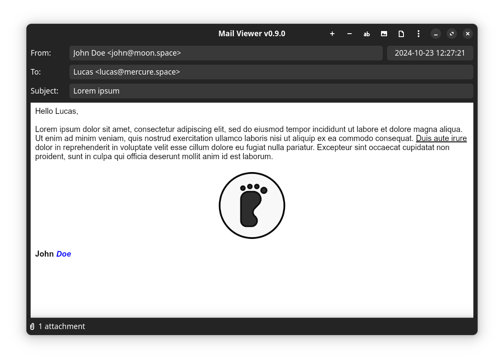

# MailViewer

MailViewer is a desktop application built with [GTK4](https://www.gtk.org/)/[libadwaita](https://gnome.pages.gitlab.gnome.org/libadwaita/doc/main/index.html) and [Rust](https://www.rust-lang.org/) that allows users to read and decode `.eml` files (email files). It provides a graphical interface for easy navigation and rendering of email content, including attachments, HTML, and plain text.

## Features

- **Open and view .eml files**: Display the email's subject, sender, receiver, and content.
- **Decode email attachments**: View attachments from `.eml` files.
- **Support for HTML and plain text emails**: Render emails in both formats.

## Sceenshot



## Installation

flatpak
- TODO


```bash
make install
```

## Dependencies

- [gtk4](https://docs.gtk.org/gtk4/)
- [libadwaita](https://gnome.pages.gitlab.gnome.org/libadwaita/doc/main/index.html)
- [gmime](https://github.com/jstedfast/gmime)
- [gtk4-rs](https://gtk-rs.org/gtk4-rs/git/book/)
- [libadwaita-rs](https://world.pages.gitlab.gnome.org/Rust/libadwaita-rs/)