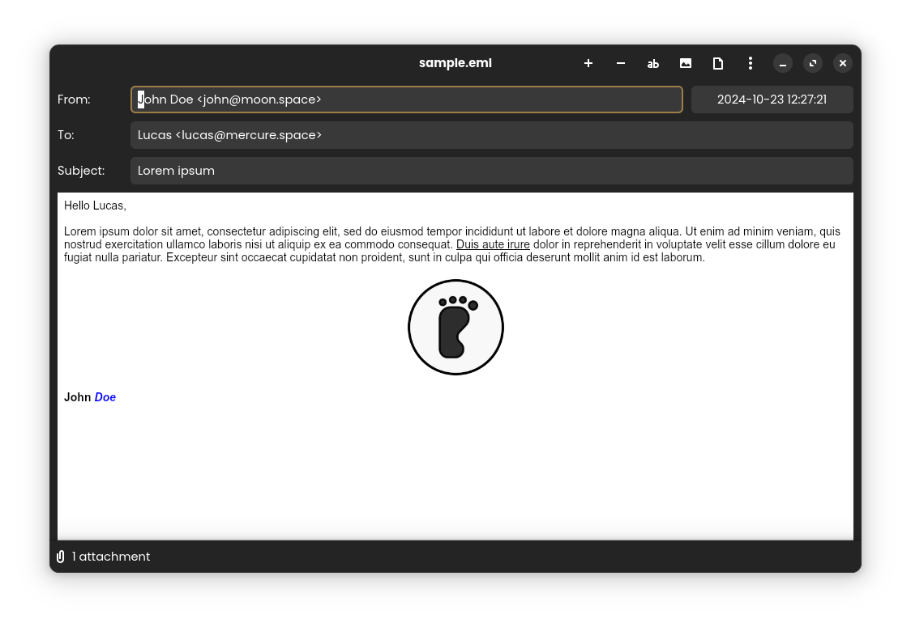
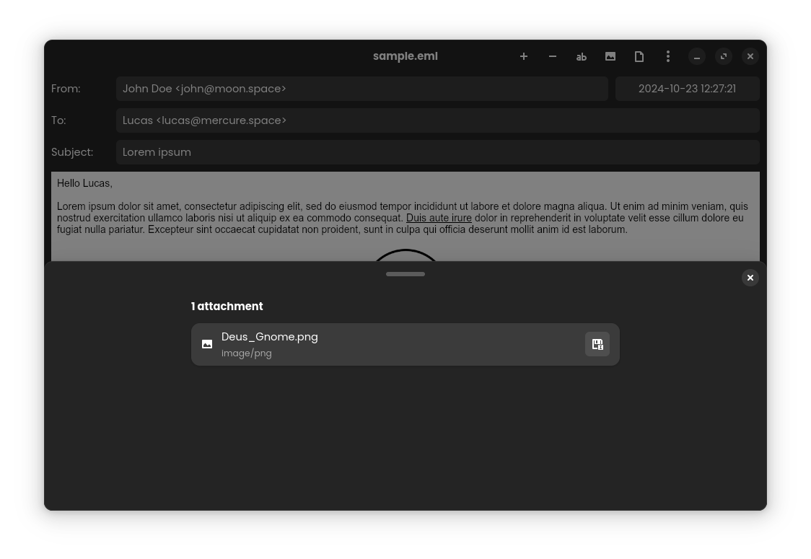

[](https://github.com/alescdb/mailviewer/actions/workflows/prerelease.yml)
[](https://github.com/alescdb/mailviewer/actions/workflows/release.yml)

# MailViewer

MailViewer is a GNOME application that allows users to read and decode `.eml` and `.msg` files (email files) without having to install any additional software or create an account.

It provides a graphical interface for easy navigation and rendering of email content, including attachments, HTML, and plain text.

Written in [Rust](https://www.rust-lang.org/) with [GTK4](https://www.gtk.org/)/[libadwaita](https://gnome.pages.gitlab.gnome.org/libadwaita/doc/main/index.html)

## Features

- **Open and view `.eml` or `.msg` files**: Display the email's subject, sender, receiver, and content.
- **Decode email attachments**: View and/or save attachments.
- **Support for HTML and plain text emails**: Render emails in both formats (if available).

## Sceenshots




## Installation

#### flatpak / flathub

[](https://flathub.org/apps/io.github.alescdb.mailviewer)

```
flatpak install --user io.github.alescdb.mailviewer
```

##### Flatpak Permissions

- Network : for fetching remote images (if the Show Images is checked, false by default), safe to disable if you don't wan't to see remote images.
- xdg-run/mailviewer (`/run/user/<uid>/mailviewer`) : for extracting attachments and opening it with associated program.


## Building

With cargo :
```bash
cargo build
```

With Makefile
```bash
make
```
(This is equivalent to `cargo build`)

```bash
make build
```
(meson build)

## Icon

Icon is from [Papirus Icon Theme](https://github.com/PapirusDevelopmentTeam/papirus-icon-theme)

Feel free to contribute an original icon, I'm not a good designer :-)

## Contributors

- [Vistaus](https://github.com/Vistaus) : nl translation
- [albanobattistella](https://github.com/albanobattistella) : it translation
